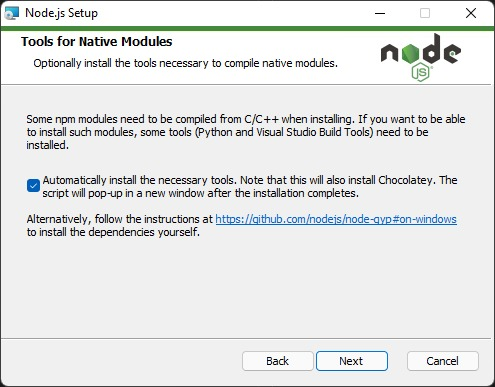

# Guia de instalação do ambiente angular

1. Faça a instalação do node.js:
https://nodejs.org/en/download/
2. Duarante a instalação selecione o campo "Instalar automaticamente as ferramentas necessárias":

3. Será aberto um terminal no final da instalação para que você confirme. Clique enter duas vezes e aguarde acabar
4. Abra o Windows Powershell e digite o seguinte código:
npm install -g @angular/cli
5. A depender do windows que está utilizando você precisará ativar a permissão de rodar scripts no sistema. Rode o seguinte código no Windows Powershell(Execute como administrador):
Set-ExecutionPolicy -ExecutionPolicy RemoteSigned -Scope LocalMachine
6. Pronto, agora você instalou o Angular e pode utilizar o CLI